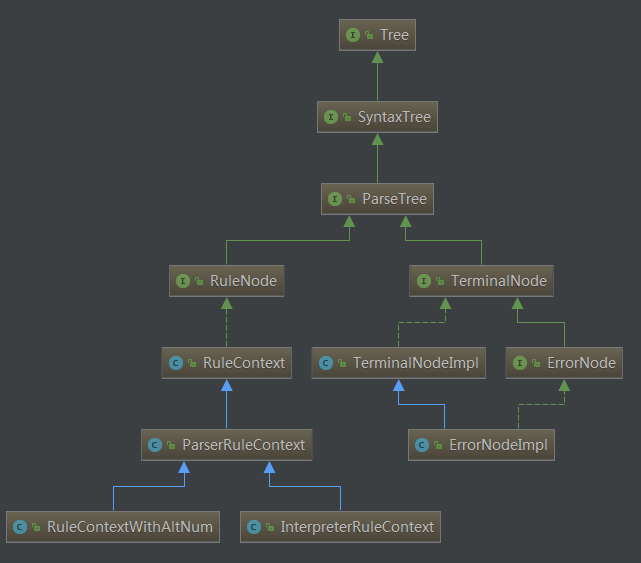
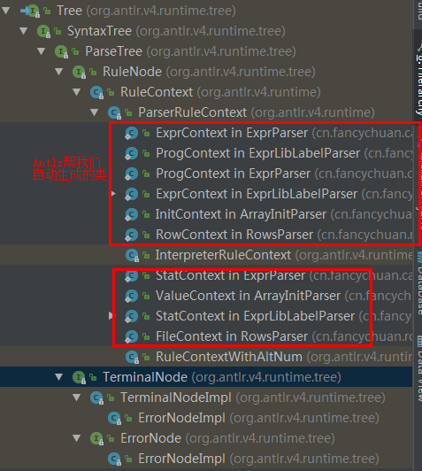
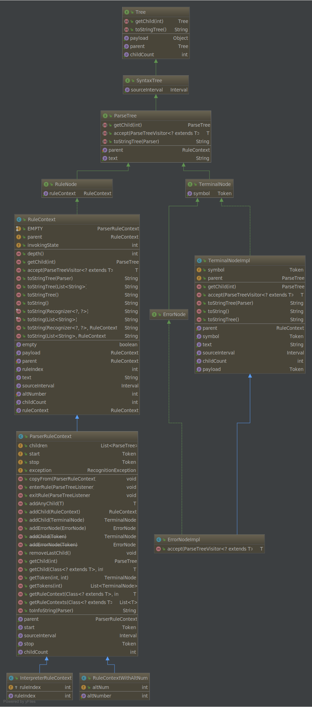

## Antlr抽象语法树节点

接口Tree定义了树的基本方法

接口SyntaxTree语法树，继承了Tree接口，并拓展了一个方法sourceInterval，这个方法用于生成词法
- Antlr提供了一个继承了SyntaxTree的接口：ParseTree
- 如果想实现自己的语法树，可以直接继承SyntaxTree

#### ParseTree
有两个子接口：
- RuleNode
    - 拥有子节点的节点，在Antlr中对应语法文件g4中的规则
    - 有一个默认实现 RuleContext
        - 这是所有Antlr自动生成的遍历树的父父类
        - 有一个子类ParserRuleContext，这是Antlr帮我们根据g4文件生成语法树的直接父类
- TerminalNode
    - 没有子节点的结点
    - 有一个子接口ErrorNode
    - 有一个默认的实现类TerminalNodeImpl
        - TerminalNodeImpl也有一个继承子类ErrorNodeImpl
        - ErrorNodeImpl继承了TerminalNodeImpl同时实现了ErrorNode接口
        
        
        
#### ParserRuleContext
有两个自带的子类：
- InterpreterRuleContext
- RuleContextWithAltNum

其他的我们自定义的语法树或者Antlr帮我们自动生成的语法树一般都直接继承ParserRuleContext，如下图所示

Antlr自动的各种类的继承关系细节，如下图所示

