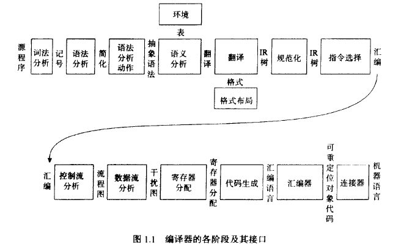
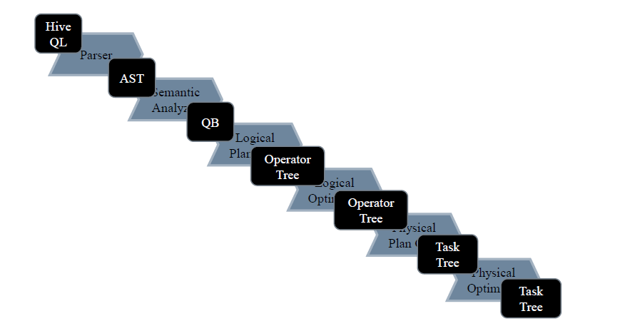

## 抽象语法树的应用

### 1.编译原理的简单介绍
#### 1.1 编译器的各个阶段

#### 1.2 Hive的工作过程

#### 1.3 词法分析
词法分析：确定型有限状态机（DFA）和不确定型有限状态机（NFA）

### 2. AST的可视化
Python： astpretty

java: idea的antlr 插件

### 3. 应用
遍历抽象语法树：访问者模式、监听者模式

antlr4的一个示例（监听者模式）

提取SQL（访问者模式）

提取血缘

