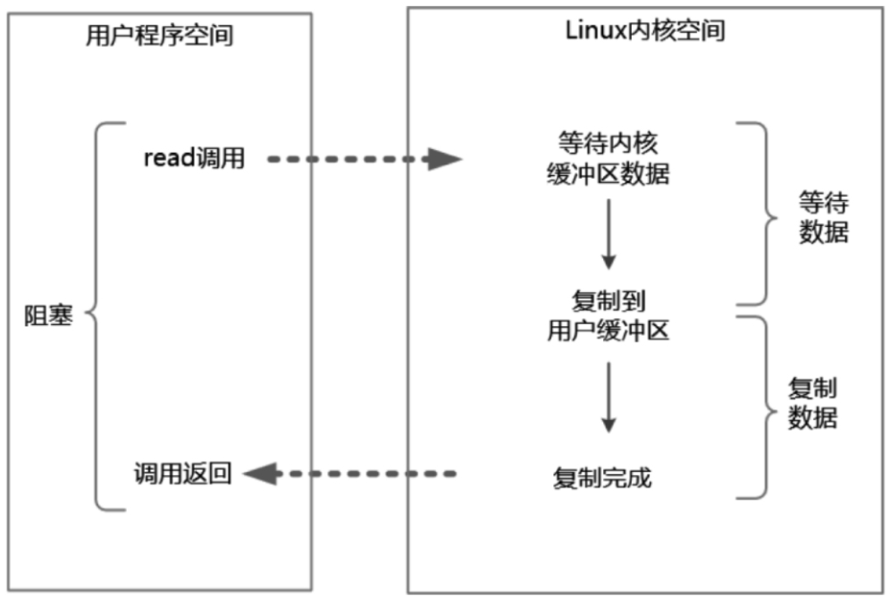
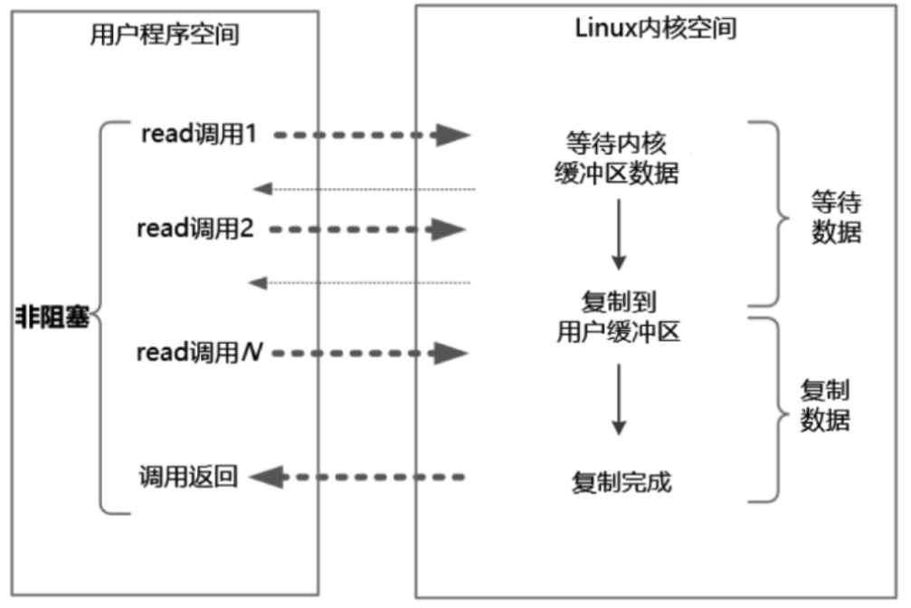
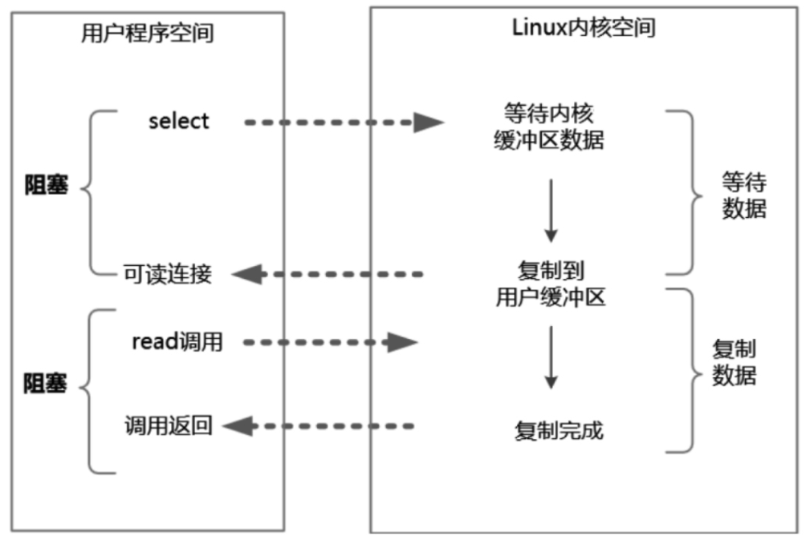
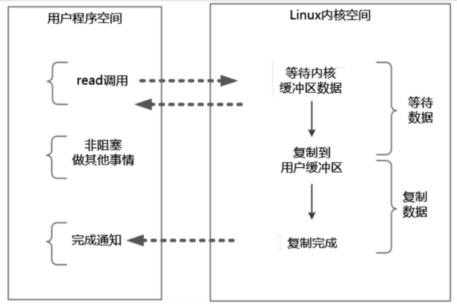

## 2. 高并发IO的底层原理
### 2.1 IO读写的原理
简单来说，应用程序的IO操作实际上不是物理设备级别的读写，而是缓存的复制。
具体来说，上层应用通过操作系统的read系统调用把数据从内核缓冲区复制到应用程序的进程缓冲区，
通过操作系统的write系统调用把数据从应用程序的进程缓冲区复制到操作系统的内核缓冲区。


为了减少底层系统的频繁中断所导致的时间损耗、性能损耗，出现了内核缓冲区

在Linux系统中，操作系统内核只有一个内核缓冲区。每个用户程序（进程）都有自己独立的缓冲区，叫作用户缓冲区或者进程缓冲区。

### 2.2　四种主要的IO模型
“阻塞”指的是用户程序（发起IO请求的进程或者线程）的执行状态。可以说传统的IO模型都是阻塞IO模型，并且在Java中默认创建的socket都属于阻塞IO模型。

阻塞IO指的是需要内核IO操作彻底完成后才返回到用户空间执行用户程序的操作指令

#### 2.2.1 同步阻塞IO
同步阻塞IO（Blocking IO）指的是用户空间（或者线程）主动发起，需要等待内核IO操作彻底完成后才返回到用户空间的IO操作。
在IO操作过程中，发起IO请求的用户进程（或者线程）处于阻塞状态



- 特点：在内核执行IO操作的两个阶段，发起IO请求的用户进程（或者线程）被阻塞了
- 优点：应用程序开发非常简单；在阻塞等待数据期间，用户线程挂起，基本不会占用CPU资源
- 缺点：一般情况下会为每个连接配备一个独立的线程，一个线程维护一个连接的IO操作。在并发量小的情况下，这样做没有什么问题。在高并发的应用场景下， 
阻塞IO模型需要大量的线程来维护大量的网络连接，内存、线程切换开销会非常巨大，性能很低，基本上是不可用的

#### 2.2.2 同步非阻塞IO
非阻塞IO（Non-Blocking IO，NIO）指的是用户空间的程序不需要等待内核IO操作彻底完成，可以立即返回用户空间去执行后续的指令，
即发起IO请求的用户进程（或者线程）处于非阻塞状态，与此同时，内核会立即返回给用户一个IO状态值。

非阻塞是指用户进程（或者线程）获得内核返回的状态值就返回自己的空间，可以去做别的事情。在Java中，非阻塞IO的socket被设置为NONBLOCK模式。



- 特点：应用系统的线程回不断的进行IO系统调用。不断的轮询数据是否准备好，直到IO系统调用完成为止。
- 优点：用户线程不用阻塞，实时性较好。
- 缺点：需要不断的轮询内核，将占用大量CPU时间，效率低下
> 在Java的实际开发中，不会涉及这种IO模型，但是此模型还是有价值的，其作用在于其他IO模型中可以使用非阻塞IO模型作为基础，以实现其高性能。

#### 2.2.3 IO多路复用
如何避免同步非阻塞IO模型中轮询等待的问题呢？答案是采用IO多路复用模型。（其实这种模型也是需要轮询的，只不过用一个线程即可）
IO多路复用（IO Multiplexing）属于一种经典的Reactor模式实现，有时也称为异步阻塞IO，Java中的Selector属于这种模型。



目前支持IO多路复用的系统调用有select、epoll等

- 特点：IO多路复用涉及两种系统调用（操作系统的内核必须提供多路分离的系统调用select/epoll）
  - 一种是IO的系统调用
  - 另一种是select/epoll就绪查询系统调用
- 优点；一个查询器的线程可以同时处理成千上万的网络连接，不需要用户创建大量的线程并维护
- 缺点：本质上select/epoll系统调用是阻塞式的，属于同步IO，需要在读写事件就绪后由系统调用本身负责读写，也就是说这个读写过程是阻塞的

#### 2.2.4 异步IO（也叫信号驱动IO）
异步IO（Asynchronous IO，AIO）指的是用户空间的线程变成被动接收者，而内核空间成为主动调用者

异步IO类似于Java中典型的回调模式，用户进程（或者线程）向内核空间注册了各种IO事件的回调函数，由内核去主动调用。

在异步IO模型中，在整个内核的数据处理过程（包括内核将数据从网络物理设备（网卡）读取到内核缓冲区、将内核缓冲区的数据复制到用户缓冲区）中，用户程序都不需要阻塞



- 特点：在内核等待数据和复制数据的两个阶段，用户线程都不是阻塞的
- 优点：
- 缺点：应用程序仅需要进行事件的注册与接收，其余的工作都留给了操作系统，也就是说需要底层内核提供支持

理论上来说，异步IO是真正的异步输入输出，它的吞吐量高于IO多路复用模型的吞吐量
> 在Linux系统下，异步IO模型在2.6版本才引入，JDK对它的支持目前并不完善，因此异步IO在性能上没有明显的优势。
> 大多数高并发服务端的程序都是基于Linux系统的。因而，目前这类高并发网络应用程序的开发大多采用IO多路复用模型。大名鼎鼎的Netty框架使用的就是IO多路复用模型，而不是异步IO模型。

### 2.3 通过合理配置来支持百万级并发连接
通过合理配置来支持百万级并发连接默认值为1024，也就是说，一个进程最多可以接受1024个socket连接
> 文件句柄也叫文件描述符，是内核为了高效管理已被打开的文件所创建的索引，是一个非负整数（通常是小整数），用于指代被打开的文件。所有的IO系统调用（包括socket的读写调用）都是通过文件描述符完成的

```
# 查看系统最大的文件句柄数
ulimit -n

# 临时设置（当前环境有效）
ulimit -n 100000

# 永久保存设置  sudo vim /etc/rc.local
ulimit -SHn 1000000
# -S 表示软性极限值， -H表示硬性极限值

# 彻底解除Linux系统的最大文件打开数量的限制 sudo vim /etc/security/limits.conf
soft nofile 1000000
hard nofile 1000000
```

## 3.JavaNIO 核心详解
### 3.1 Java NIO简介
在1.4版本之前，Java IO类库是阻塞IO；从1.4版本开始，引进了新的异步IO库，被称为Java New IO类库，简称为Java NIO。New IO类库的目标就是要让Java支持非阻塞IO

总体上说，NIO弥补了原来面向流的OIO同步阻塞的不足，为标准Java代码提供了高速、面向缓冲区的IO

三个核心组件：
- Channel（通道）
  - 在NIO中，一个网络连接使用一个通道表示
  - 相当于输入流和输出流的结合。
- Selector（选择器）
  - 选择器可以理解为一个IO事件的监听与查询器
  - 通过选择器，一个线程可以查询多个通道的IO事件的就绪状态
  - 
- Buffer（缓冲区）
  - 所谓通道的读取，就是将数据从通道读取到缓冲区中；
  - 所谓通道的写入，就是将数据从缓冲区写入通道中

> NIO属于 IO多路复用模型

#### NIO和OIO的对比
- （1）OIO是面向流（Stream Oriented）的，NIO是面向缓冲区（BufferOriented）的
  - OIO不能随意改变读取指针的位置，只能顺序进行
  - NIO能随意读取Buffer中任意位置的数据
- （2）OIO的操作是阻塞的，而NIO的操作是非阻塞的。
- （3）OIO没有选择器（Selector）的概念，而NIO有选择器的概念
  - NIO使用选择器的最大优势是系统开销小