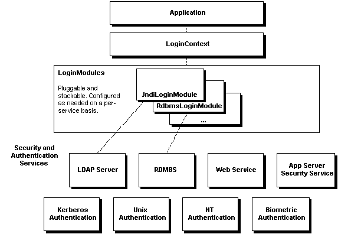

## java安全与授信

### JAAS
JAAS（Java Authentication and Authorization Service）是java平台提供的认证与授权服务，能够控制代码对敏感或关键资源的访问，
例如文件系统，网络服务，系统属性访问等，加强代码的安全性

主要包含授权和认证两部分

下面为架构概述图
- 应用程序主要跟LoginContext打交道
- 动态配置的LoginModules
    - JndiLoginModule是JAAS提供的参考实现
- JAAS是可堆叠的，安全模块堆叠在一起按照顺序呗调用
    

【参考资料】
1. [java security专栏](https://blog.csdn.net/xtayfjpk/category_3243529.html)