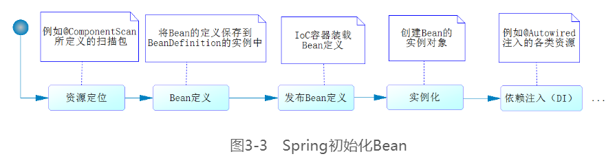

## Spring相关概念

IOC：控制反转
- Bean模块
    - 将类和类之间的依赖从代码中脱离，采用配置的方式进行依赖关系描述
    - IOC容器负责依赖类之间的创建、拼接、管理、获取等工作
    - BeanFactory接口是Spring的核心接口，实现了容器的许多功能
    - 生命周期
        - 定义
            - 1.通过配置如@ComponentScan定义的路径去扫描@Component的类，就是一个资源定位的过程。
            - 2.找到资源后开始解析，并将定义的信息保存起来
            - 3.把Bean的定义发布到Spring IoC容器中。完成这三个操作也还没有bean实例的生成，更没有完成依赖注入
        - 初始化
            - 有的时候我们需要再取出来使用bean的时候再初始化，那么就可以在ComponentScan中加上配置项lazyInit=true
            - Spring在完成依赖注入后，还提供了一系列的接口和配置来完成Bean的初始化过程。见下图
        - 生存期
        - 销毁




- Context模块
- 表达式语言模块

AOP
> 面向横切面编程。在Spring中实现AOP有多重选择
- Spring AOP
- AspectJ（AOP语言级框架）
- java.lang.instrument

数据访问与集成
> 程序的核心问题都是对数据的访问和操作，数据有多种表现形式，需要有不同的技术
- JDBC
- ORM 
- OXM 
- JMS
- 事务管理


Web及远程操作
- 建立在Spring Context模块之上


持久化层
- 负责数据的访问和操作，DAO类被上层的业务类调用
- 主要工作是从数据库中加载数据并实例化为领域对象，或者将领域对象持久化到数据库中


声明式事务处理
```
// 将两个DAO组织起来共同完成一个事务性的数据操作。这就是Spring声明式事务配置的高明之处，让业务类也可以享受EJB声明式事务的好处
    public void loginSuccess(User user) {
        LoginLog loginLog = new LoginLog();
        loginLog.setUserId(user.getUserId());
        loginLog.setIp(user.getLastIp());
        loginLog.setLoginDate(user.getLastVisit());
        loginLogDao.insertLoginLog(loginLog);
    }
```

